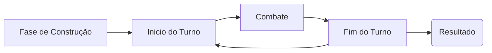

# Rewbs! 
*[alpha 0.0.3]*

**O projeto gira em torno de um jogo de pets.**

Introdução básica, os bews são bichinhos digitais "NFTs" (NFTs entre aspas devido que cada bew é único e não se pode existir outra cópia do mesmo no jogo), o site deve girar em torno deles e do sistema de batalha entre eles. A aplicação deve dar liberdade do usuário gerenciar seus pets e "items" para o combate, além de que sua api seja acessível para que o discord bot tenha acesso.

*Qualquer palavra abaixo que gere dúvida pode estar explicada no glossário ou exemplos.🙂
>*Informações dentro de citação são anotações.✍

## Site (resumo):
- Landing Page -> Página inicial com informações e imagens para convencer a pessoa a jogar.
- Ranks -> Página listando os com maior level e os mais ricos.
- Dashboard ->
	 - Home -> Informações gerais, como quantia de rewbs, level, entre outros.
	 - Bews -> Informações dos Bews, como posição de batalha, alegria, entre outros.
	 - Joguinhos -> Joguinhos bobos para aumentar a felicidade dos bews.
	 - Loja -> Área para comprar pacotes, invocações e comprar rewbs com dinheiro real.
- About -> Informação sobre o site e a administração.

## API (resumo):
- Invocar, Cruzar ->  Gerar bews e garantir que não exista cópia.
- Pacote -> Dar duas cartas aleatórias para a pessoa.
- Batalha -> Simular a batalha e voltar um gif da simulação.
- Mercado -> Confirmar compras de rewbs.
- [Banco de Dados](https://github.com/WilckerK/rewbs/blob/main/BANCODEDADOS.md) -> Passar as informações do db.
- Trocas -> Trocas de bews entre jogadores.

## Development

### Front-end:
Desenvolver o site, certificando-se de que a pessoa esteja autenticada ("logada") para que possa manter a navegação pelo dashboard. Tema com cores análogas ao vermelho escuro, background preto e outros detalhes em branco. E foco sempre no layout intuitivo.  

### Back-end:
Desenvolver a API, certificando-se de que a aplicação que está acessando é verificada, e prezando pela segurança do banco de dados. Responsável pela lógica do jogo.

# Glossário
- **Rewbs**: Moedinha do jogo, vai ser possível ganhar rewbs por vencer batalhas ou por "daily". Comprar na loja também deve ser uma opção.
- [**Bews**](https://github.com/WilckerK/rewbs/blob/main/BEWS.md): Pets, eles são objetos dentro do objeto do usuário. Cada bew tem valores fixos e alteráveis como: rank, ataque, velocidade, acerto, resistência, felicidade, entre outros. Cada bew tem seu id próprio. Caso a felicidade do bew chegue a 0 ele "foge" e deixa o jogador. 
- **Invocar**: Ao pagar Rewbs será possível invocar um bew novo, tendo uma baixa chance de falha (a chance natural de 1/20 ou caso a pessoa por acaso do destino gere um bew já existente, assim retornando falha), o preço da invocação aumenta pela quantidade de bews que ela tem.
- **Cruzar**: Invoca um bew com características dos pais, que por sua vez acaba perdendo eles (os pais) no processo. 
- **Cartas**: Dois tipos de cartas, sendo carta de resposta e cartas de mapa, suas ações são explicadas nos exemplos.
- **Pacote**: Pacotes podem ser comprados com rewbs e darão ao jogador duas cartas aleatórias.

# Exemplos
### Objeto do User:
```json
{
	"name": "Iberê",
	"id": "lfhgolsnvoh8u494hfkjf466sh",
	"discordId": "34534536363456",
	"exp": 87987,
	"rewbs": 1340,
	"bews":[
		{
			"name":"Rebew", 
			"bewId":"INS000H12C1REEPS1S2I115151545", 
			"feli": 100,
			"item": "Pena",
			"image": "adefeqjo8hfoeunfajldnfoeqhafunaefuiaegfyagdbjfhcaejbjlakelnflandhu=="
		},
		{
			"name":"Myra", 
			"bewId":"CUR001F03G2ETFER3000002011502", 
			"feli": 75,
			"item": null,
			"image": "gjkjefgeqfsgsfgsgsfhjo8hgjfoegnfoeqhjkkgfyagdbjfhcaegjkgjjbjlasfghsu=="
		}
	],
	"cartas":{
			"resposta": ["Coroação", "Agrotóxico", "Coroação", "Domar uma Fera", "Berçário"],
			"mapa": ["Berçário", "Mina"],
			"item": ["Pena", "Livro"]
		}
}
```
### Cartas:
- **Resposta**: São cartas que interagem durante a batalha (famosas cartas rápidas, magias instantâneas, armadilhas), como por exemplo: "Domar uma Fera", caso seu bew do brasão Fera seja atacado por um ataque efetivo, seu próximo ataque será causará 3 vezes o dano.

- **Mapa**: São cartas que tem seu efeito ativo no começo de cada turno, por exemplo: "Berçário", no começo de cada turno o bew de maior rank em campo tem seus status cortados pela metade até o final do turno.

- **Item**: São cartas de efeito apenas ao bew que o segura.  

### Turno:

Fase de contrução monta o campo com o ele deve prosseguir durante a batalha
Fase inicial é para os preparos antes da batalha, inclusive o mapa
Combate, porradaria, o bew mais rápido bate primeiro.
Fase final, remonta o campo antes de passar para o próximo turno ou resultado.
Resultado vê quem ganhou e lhe dá rewbs e exp, além de retirar exp de quem perdeu.

# Referências
- **Web**:
	- [YAGPDB](https://yagpdb.xyz/)
	- [Dyno](https://dyno.gg/)
``` xml
<palette>
<color name='Red-1' rgb='8C030E' r='140' g='2' b='14' />
<color name='Red-2' rgb='260104' r='38' g='0' b='3' />
<color name='Red-3' rgb='8C031C' r='140' g='2' b='28' />
<color name='Red-4' rgb='40010D' r='63' g='1' b='12' />
<color name='Black' rgb='0D0D0D' r='12' g='12' b='12' />
</palette>
```

- **API**:
	- [Super Auto Pets](https://teamwood.itch.io/super-auto-pets)
	- [Pokemon](https://pokemon.com)
	- [Tamagotchi](https://pt.wikipedia.org/wiki/Tamagotchi)

- **Tecnologias**:
	- **Next.js**: [Getting Started | Next.js (nextjs.org)](https://nextjs.org/docs/getting-started)
	- **Next-Auth**: [NextAuth.js (next-auth.js.org)](https://next-auth.js.org/)
	- **Flask**:[Flask (flask.palletsprojects.com)](https://flask.palletsprojects.com/en/2.2.x/)
	- **PyMongo**: [PyMongo — MongoDB Drivers](https://www.mongodb.com/docs/drivers/pymongo/)
	- **Square**: [Square Cloud - Sua aplicação online](https://squarecloud.app/)

# Link Úteis
- [Planilha dos Bews](https://docs.google.com/spreadsheets/d/1JtYD7HOH2AdcL9KxdH-sBE2PINgIFIMStCfiCNTYXjk/edit?usp=sharing)
- [Reb-info](https://discord.gg/ZgTjANdwcS)
- [Reb Repositório](https://github.com/WilckerK/reb)

**Os link úteis podem estar desatualizados em relação a ideias e programações, mas podem ser usados como base e/ou para ter uma ideia.*

# Notas:
- Forma de câmbio de rewbs entre jogadores.
- Modo Casual, seria baseado no sistema do super auto pets de montar seu time durante uma jogatina com bews random.
- Algum tipo de mensalidade que dê benefícios ao user, como pacotes e rewbs bonus no começo do mês.
- Cosméticos.
- Alimentar os bews para aumentar a felicidade.

**As notas são ideias não acabadas sobre adições ao projeto.*

##
**Todo o markdown pode ser alterado por qualquer membro da equipe, não se acanhe ao acrescentar uma informação.*
